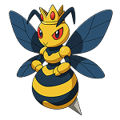
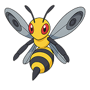
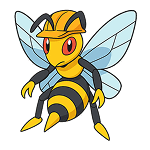

# 🐝 Wasp Nest Game

Battle against a swarm of wasps in this action-packed browser game! Zap workers, drones, and their queen to win. Each wasp has unique energy levels and recovery times.


## 🎮 How to Play

1. Click the zapper button to randomly hit a wasp
2. Each zap deals 11 damage
3. Knock out all wasps or just the queen to win
4. Knocked out wasps recover after 40 seconds
5. Reset the game anytime with the reset button

## 🐝 Wasp Types

### Queen Wasp 👑


- Energy: 52
- Size: Largest (140px on desktop)
- Special: Knocking out the queen instantly wins the game
- Count: 1 per game

### Drone Wasp 🔷


- Energy: 20
- Size: Medium (120px on desktop)
- Count: 5 per game

### Worker Wasp ⚡


- Energy: 30
- Size: Small (100px on desktop)
- Count: 7 per game

## 🎯 Game Mechanics

### Energy System

- Energy bars show current wasp health
- Colors indicate energy levels:
  - Green: > 60% energy
  - Yellow: 30-60% energy
  - Red: < 30% energy

### Knockout System

- Wasps are knocked out when energy reaches 0
- Knocked out wasps:
  - Stop moving
  - Show recovery countdown
  - Recover to full energy after 40 seconds

### Visual Effects

- Zapped wasps show electrocution animation
- Energy bars update in real-time
- Smooth transitions and animations
- Responsive design for all screen sizes

## 🖥️ Technical Details

### Game Configurations

```javascript
// Game Configuration
Zap Damage: 11
Knockout recovery time: 40 seconds
Wasps: 1 Queen, 5 Drones, 7 Workers

// Wasp Energy Levels
Queen: 52 energy
Drone: 20 energy
Worker: 30 energy
```

### Responsive Sizes

```css
/* Mobile */
Queen: 80px
Drone: 60px
Worker: 40px

/* Tablet (768px+) */
Queen: 100px
Drone: 80px
Worker: 60px

/* Desktop (1024px+) */
Queen: 140px
Drone: 120px
Worker: 100px
```

## 🎨 Color Scheme

```css
Primary (Green): #2e7430
Secondary (Blue): #074582
Warning (Orange): #ffa500
Energy Levels:
- Full: var(--color-success)
- Medium: var(--color-warning)
- Low: var(--color-danger)
```

## 🚀 Getting Started

1. Clone the repository
2. Open `waspgame.html` in your browser
3. Start zapping wasps!

## 🧪 Running Tests

1. Open `waspgametest.html` in your browser
2. View test results for:
   - Game Engine
   - Display Engine
   - Wasp Behavior
   - Tutorial Engine

## 🛠️ Built With

- Vanilla JavaScript
- CSS3 with Custom Properties
- HTML5
- Object-Oriented Programming
- Responsive Design (mobile-first)
- Unit Tests
